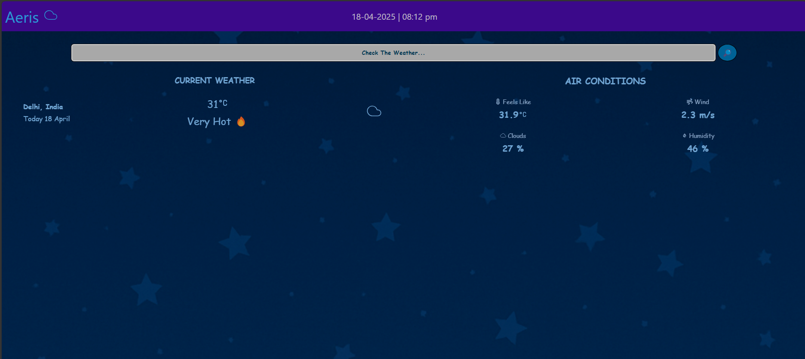

# 🌦️ Aeris - Weather Forecast App

Aeris is a sleek, modern React weather app that fetches live weather data using the Tomorrow.io API. Just type in any city or location and get the current temperature, air conditions, and other weather metrics in real-time.

---

## 🔥 Features

- 🌍 Search for any location’s weather
- 📦 Real-time temperature with condition-based labels (e.g. "Hot ☀️", "Freezing ❄️")
- 🌬️ Air condition stats like:
  - Feels like temperature
  - Wind speed
  - Cloud coverage
  - Humidity
- 🕒 Live clock and date display
- ✨ Loading animation while data is being fetched

---

## 📸 Screenshots

| Homepage with Weather Data |
| -------------------------- |
|  |

---

## 🚀 Getting Started

### 🔧 Prerequisites

- Node.js and npm installed

### 📦 Installation

```bash
git clone https://github.com/your-username/aeris-weather-app.git
cd aeris-weather-app
npm install
```
